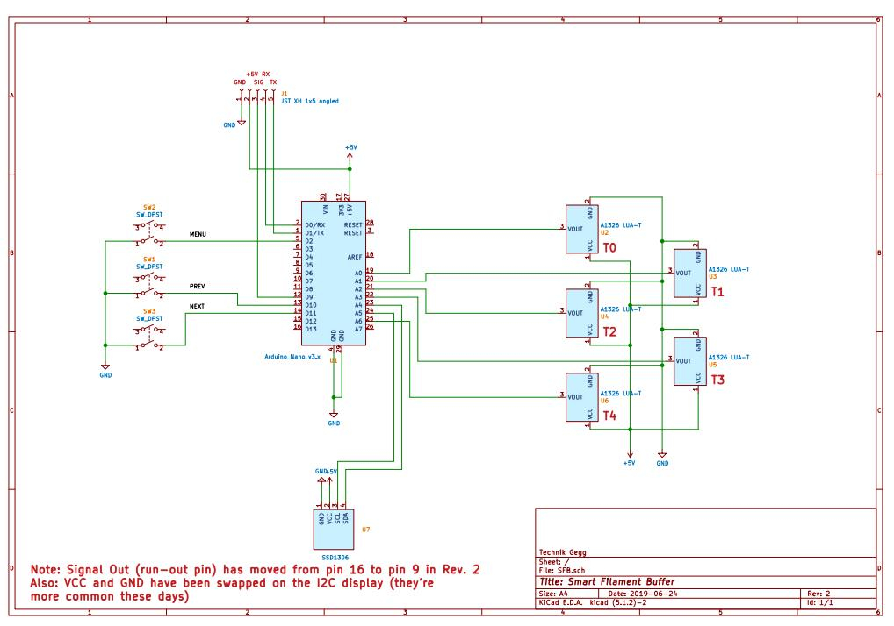
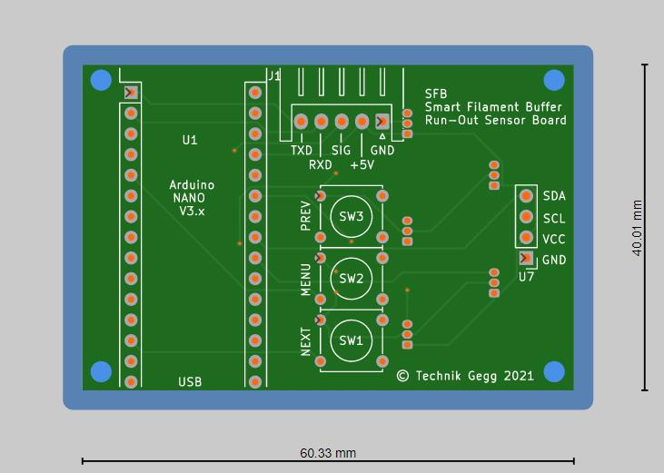
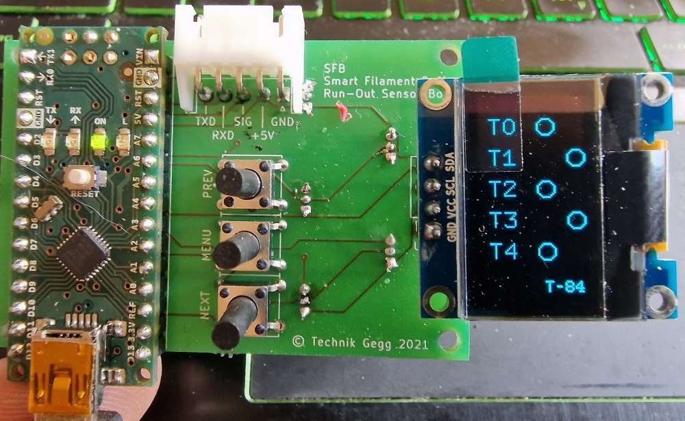
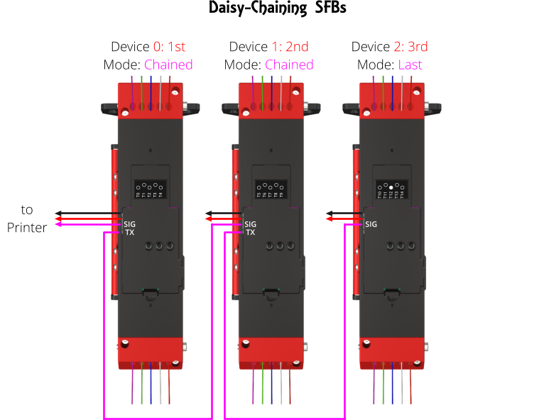

# Welcome to the SFB project

This is the firmware for the **S**mart **F**ilament **B**uffer as published on [Printables](https://www.printables.com/de/model/197621-smart-filament-buffer-2) and [Thangs](https://thangs.com/mythangs/file/58718).

The Smart Filament Buffer (used for multi-material 3D printing) comes with an integrated 5 fold filament run-out detector, which is based on the Arduino Nano and a bunch of linear Hall-Effect sensors.
An integrated I2C OLED makes reading the current status and it's configuration a breeze.

This project utilizes PlatformIO and VS-Code. Make sure you have those tools installed on your PC/Mac, open the project in VS-Code, build it, flash it onto the Arduino Nano and you're all set to go.

The schematic for this project is pretty simple and straight forward:



All the electronics will fit onto a standard 60x40 mm prototype board.

If you don't feel like wiring all this up on a prototype board by hand, head over to my [PCB repository at AISLER](https://aisler.net/technik-gegg/smuff/sfb-pcb) where you can comfortably order one or more PCB(s) right away. Usually, you will get your PCB made and delivered within 7 (work) days.

[](https://aisler.net/technik-gegg/smuff/sfb-pcb)
<figure>
    
    <figcaption>Assembled PCB, with courtesy of maker Defenc</figcaption>
</figure>

Beside the Arduino Nano, the OLED and sensors, you have 3 push buttons, labelled *PREV*, *MENU* and *NEXT*, to handle the integrated menus.
Connector J1 is being used to attach the SFB to your 3D printer, which will supply the power to the SFB on pins 1 and 2 (GND/+5V).
Pin 3 (SIG) is used to connect the run-out signal to the E-STOP header on your 3D printer controller, which becomes HIGH (+5V) as soon as a run-out is triggered.

Configured correctly, this run-out signal will cause your 3D Printer to pause the print before it starts printing hot air.

On a Duet3D controller board for example, you'll need to add these two lines of GCode in your *config.g*:

```Gcode
M591 D0 P2 C2 S1        ; Set filament sensing sensor to switch (active high)
M581 E0 T1 S1 C1        ; Configure external trigger to pause the print only when printing
```

Klipper in contrast requires you to configure the according pin of the "runout_sensor" in your *printer.cfg* file, i.e. pin GPIO16, active high:

```Python
[filament_switch_sensor runout_sensor]
switch_pin: gpio16
pause_on_runout: True
```

In Marlin you'll need to enable and set up the run-out sensor in your *Configuration.h* file, compile and flash the new firmware. For example: Pin PA15, active high:

```Arduino
#define FILAMENT_RUNOUT_SENSOR
#if ENABLED(FILAMENT_RUNOUT_SENSOR)
  #define FIL_RUNOUT_ENABLED_DEFAULT true    // Enable the sensor on startup. Override with M412 followed by M500.
  #define NUM_RUNOUT_SENSORS   1             // Number of sensors, up to one per extruder. Define a FIL_RUNOUT#_PIN for each.
  
  #define FIL_RUNOUT1_PIN      PA15          // Depends on your controller board!
  #define FIL_RUNOUT1_STATE    HIGH          // Pin state indicating that filament is NOT present.
  #define FIL_RUNOUT1_PULLDOWN               // Use internal pulldown for filament runout pins.
  ...
#endif
```

Pin 4 (RX) and Pin 5 (TX) of J1 are routed to the Arduino Nano serial port, which can be used to command the SFB to monitor a specific tool only. If none is set (T= -1), all sensors are monitored and the run-out triggers as soon as no sensor reports detecting "filament loaded".
Ideally, this communication path is wired to your controller (either your 3D printer or the SMuFF) in order to set up the tool to monitor automatically during a print.

# Calibration

Before the SFB is ready to use, you'll need to calibrate it. Therefore, press the *MENU* button to open the main menu and select the item **Sensors**. The SFB will print the current sensor values on the display. Take care that, as long as no filaments are loaded, all sensors are within the same value range (+-20 Gs).
If one or more of the sensors show a negative value while all others show positive values, you have to flip the magnets - of those showing negatives - upside-down.
Once you push against the steel ball of one of the sensors, the sensor readout will raise towards the max. value of 640 (Gs). This way you're able to check whether all sensors are working correctly.
Once all sensors are in the same (lower) range, press the **PREV** button to start the calibration sampling. After the sampling is done, the SFB will show the min./max. Gauss values at the very bottom of the display.
Now press the **NEXT** button in order to store these values in EEPROM and the calibration is done.

# Run-out detection

In "simple mode", the run-out detection does not need to know which filament is currently in use. It will monitor all sensors continously and as soon as all of them are below the threshold (1.75 times the calibrated min. Gauss value), it'll start the run-out countdown after which the run-out is signaled.
If one of the sensors gets triggered while the countdown is running, the countdown will be interrupted and the counter reset. This behaviour is needed for retractions and/or tool changes.
Via the integrated menu **Trigger**, you're able to change the countdown timespan (15 to 120 seconds), which gets stored in the Arduinos EEPROM.

In "control mode" (means: your SFB is connected to either the SMuFFs or the 3D printers TTL serial interface via the *RX* pin), the SFB will monitor the run-out for the requested tool only, which is set after a **Tn** command has been received (n = tool number). All other sensors will be ignored and also not drawn onto the display.
This stays valid until the tool is being reset by a **T-1** command, which basically instructs the SFB to return to "simple mode". *Please notice: Once a tool has been set, it'll be stored in the EEPROM, so that the current tool will stay active even after the SFB has been reset*

# Daisy-Chaining SFBs

Daisy-Chaining SFB devices allows you to handle more than 5 tools/filaments (up to 20).
In order to use this feature, you need to add a wire from the **SIG** output of the next device to pin **TX** of the current device, set it to **Chained**/**Last** in the settings menu **Mode** and assign an ID in settings menu **Device** (according to the picture below). **Chained** means there is yet another device in the chain sending a run-out signal, **Last** means this is the very last device in the chain.



In Daisy-Chain mode only the first (0: 1st) SFB will pass the run-out signal to the 3D Printer, which follows the same strategy as with one SFB in "normal" mode, whereas the "last" device will initiate the run-out countdown.
Also, numbering of the tools will be set according to the device IDs, i.e. T0-T4 on *1st*, T5-T9 on *2nd*, T10-T14 on *3rd*.

**Please keep in mind:**

+ In Daisy-Chain mode the *TX* pin of the SFB will be detached internally and thus, it won't be able to send any data back to the controller. Though, you're still able to send *Tn* commands from the controller to the device.
+ *For flashing the firmware you **must** detach the connector from J1.*
+ All devices need to be powered with +5V/GND from the same source.
+ In order to use the tool select feature (monitoring only one sensor) all devices must be able to receive the according command via the *RX* pin. This may require adding an external driver IC (i.e. [SN74LS126A](https://www.ti.com/lit/ds/symlink/sn74ls126a.pdf) or similar) between the *TX* wire of the senders serial interface and the *RX* input of the SFBs if you encounter the SFBs aren't reacting to the T*n* commands.

# Credits

A shout-out goes to [Oliver Kraus]( https://github.com/olikraus/U8G2_Arduino) for his amazing U8G2 display library and [Albert van Dalen](https://github.com/avandalen/avdweb_AnalogReadFast) for his fast analog library.

# Recent changes

### 2022-08-10

+ overhauled this README
+ added overflow prevention while setting the run-out timer.
+ added [Albert van Dalen's library](https://github.com/avandalen/avdweb_AnalogReadFast) for a faster read out of the Hall sensor values.
+ added option to show the *Info* screen when pressing the **PREV** button in main screen.
+ added option to show the *Sensors* screen when pressing the **NEXT** button in main screen.
+ added configurable rotation of the tool names (T*n*) on the main screen for better readability in different orientations of the SFB. Everything else stays in Portrait mode.
+ prefixed debug messages with "echo:" to not spam the 3D printer controller.

### 2022-08-08

+ status display on startup (reset) will show the current Mode and device ID.
+ renamed menu item *Defaults* to *\*Reset\** because it fits better and makes more sense actually.
+ added Daisy-Chain mode, which allows you to "chain up" multiple SFBs to one virutally bigger unit.

### 2022-08-06

+ replaced the Full buffer of the OLED display with Page buffers because the Arduino ran into low memory issues. Refresh/drawing of the display will be a bit slower now.
+ added sending some debug messages to the serial port while the device is initializing.
