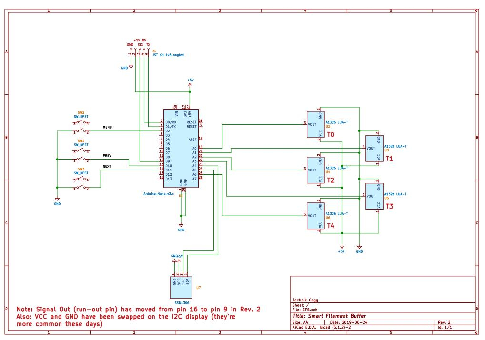
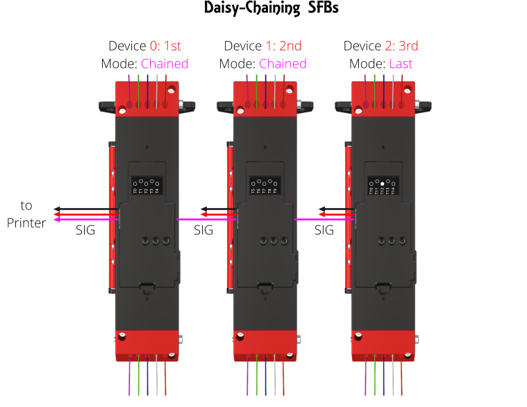

# SFB

Firmware code for the  Smart Filament Buffer as published on [Printables](https://www.printables.com/de/model/197621-smart-filament-buffer-2).

This filament buffer comes with an integrated filament run-out detector, which is based on the Arduino Nano and a bunch of linear Hall-Effect sensors.
An integrated OLED display makes reading the current status and configuration a breeze.

The schematics for this project are pretty straight forward:

All the electronics will fit on a standard 60 x 40 mm prototype board.

If you don't feel like wiring all this up on a prototype board, head over to my [PCB repository at AISLER](https://aisler.net/technik-gegg/smuff/sfb-pcb)), where you can order a PCB right away. Usually, you'll get your PCB made and delivered within 7 (work) days.

There are 3 push buttons used to handle the integrated menus. J1 gets connected to your 3D printer and will take a 5V and GND power input on pins 1 and 2, pin 3 will be set to HIGH as soon as a run-out has been detected. Configured correctly, this signal will cause your 3D Printer to pause the print before it runs out of filament.

On a Duet3D controller board you'll need these two lines of GCode in your config.g:

~~~

M591 D0 P2 C2 S1        ; Set filament sensing sensor to switch (active high)
M581 E0 T1 S1 C1        ; Configure external trigger to pause the print only when printing
~~~

Pins 4 and 5 are routed to the Arduino serial port, which can be used to tell the SFB which specific tool to monitor. If none is set (T = -1), all sensors are monitored and the run-out triggers as soon as no sensor reports having filament loaded. Ideally, this communiction path is somehow wired to either your printer or the SMuFF in order to transmit the tool in question automatically during prints.

# Run-out detection

The run-out detection does not need to know which filament is currently in use. It will monitor all sensors continously and as soon as all of them are within the threshold (+-50 Gauss by default), it'll start a timeout countdown (default 60 seconds) after which the run-out signal will be set.
If one of the sensors gets triggered while the counter is active, the counter will be interrupted and reset. This behaviour is needed for retractions and/or tool changes.
Via the integrated menu, you'll be able to configure the timeout timespan (15 to 120 seconds), which gets stored in the Arduinos EEPROM.
Also, the trigger threshold can be monitored and sampled via the menu interface. Usually, the default values ought to be be in the range of +-50 Gauss. Any value below or above this threshold is being considered as "loaded".

# Recent changes

### 2022-08-07

+ added Daisy-Chain mode, which allows you to "chain up" multiple SFBs to one virutally bigger unit. To use this feature, you need to add a wire manually from the **SIG** output of the next device to pin **D8** of the current device, set it to **Chained**/**Last** in the settings menu **Mode** and assign an ID in **Device** (see picture below). **Chained** means there is another device sending a run-out signal, **Last** means this device is the last one in the chain.

In Daisy-Chain mode only the first SFB will pass the run-out signal to the 3D Printer, which follows the same strategy as with one SFB in "normal" mode. Also, the numbering of the tools will be set according to the device ID (i.e. 0-4, 5-9, 10-14).
**Keep in mind that all devices need to be powered with +5V/GND from the same source.**

+ status display on startup (reset) will show the current Mode and device ID.
+ renamed menu item *Defaults* to *\*Reset\** because it fits better and makes more sense actually.

### 2022-08-06

+ replaced the Full buffer of the OLED display with Page buffers because the Arduino runs into low memory issues. Refresh of the display will be slower now.
+ added some output to the serial port while the device is initializing (for debug purposes)
